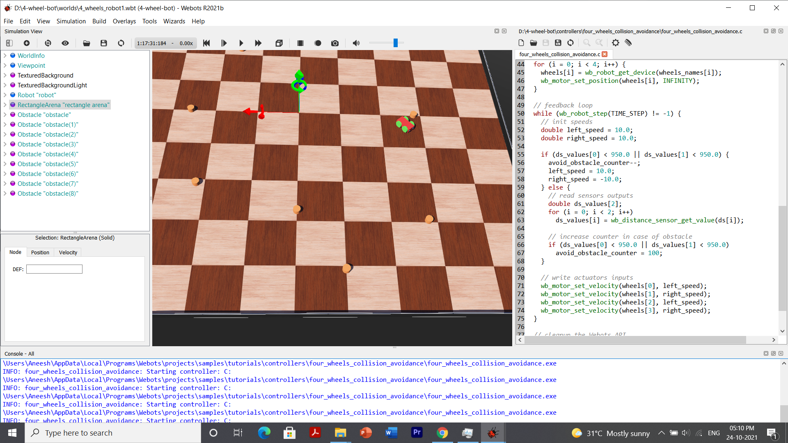

# 4-wheel-bot

This repository exhibits a code for a 4-wheel bot which is designed with the aim of avoiding obstacles coming it's way. This bot was designed using a software [Webots : robot simulator](https://cyberbotics.com/).

